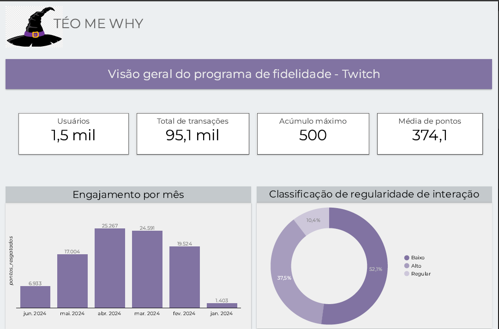

  
 Loyalties Program TeoMeWhy Twitch 

 
 Confira o dashboard interativo <a href="https://lookerstudio.google.com/u/0/reporting/58d73522-f6d6-4e8a-bf00-822e3b064e55/page/P103D">aqui</a>!

 
-------------------------------------------

### INTRODUÇÃO

O Téo Calvo implementou em suas lives o sistema de fidelidade para os seus espectadores incentivando a galera a permanecer em suas lives enquanto podem interagir com o próprio Teo e demais espectadores. Conforme os usuarios realizam as interações durante as lives, ganham pontos e podem acumular esses pontos como podem fazer trocas por recompensas e realizar ações ao vivo.

O objetivo aqui é analisar o comportamento dos usuários em relação a quantidade de transações e pontos acumulados, identificar quem são os usuários que mais interagem e os que menos interagem, e sugerir melhorias para aumentar o engajamento nas lives

------------------------------------------

## 🎲​ Dataset 

 

------------------------------------------------------------------------

## 🛠 Habilidades

| Linguagem | Descrição |
| --- | --- |
| `SQL` | Manipulação e otimização na análise de dados |

| Ferramentas | Descrição |
| --- | --- |
| `Looker Studio` | Criação de gráficos e geração dashboard para visualização de dados e insights |
| `BigQuery` | Manipulação e otimização na análise de dados e estatística, também por estar integrado ao Looker Studio |

--------------

## 💬​ Principais Comandos

| Comando   | Tipo       | Descrição                           |
| :---------- | :--------- | :---------------------------------- |
| `SELECT...FROM` | `todos` | **Obrigatório**: Retorna todas as linhas da tabela, independente das colunas selecionadas. |
| `COUNT` | `INT64,FLOAT...` | Contar o número de registros em uma consulta subjacente, retornando um número inteiro. |
| `PARSE_DATE` | `DATE,TIMESTAMP...` | Converte uma representação string de data em um objeto date. |
| `EXTRACT` | `DATE, TIMESTAMP...` | Retorna em string o valor correspondente à parte da data seleciona, este valor pode ser: dayofweek (dia da semana). |
| `WITH` | `string` | Criação de CTE(expressão de tabela comum). Uma CTE é como uma tabela que é preenchida durante a execução da consulta. |

----------------------------------

## 👩🏻‍💻​ Aprendizados

Este projeto me desafiou a utilizar a estatística para entender como está a saúde do programa de fidelidade das lives diárias do Téo.
Pude colocar em prática também toda minha criatividade no dashboard como meu aprendizado em SQL.

------------------------------------

## 🔗​ Úteis

- Imagens: contém imagens do dashboard
- Code: contém o código da análise
- Dashboard: contém o dashboard para download em PDF!
